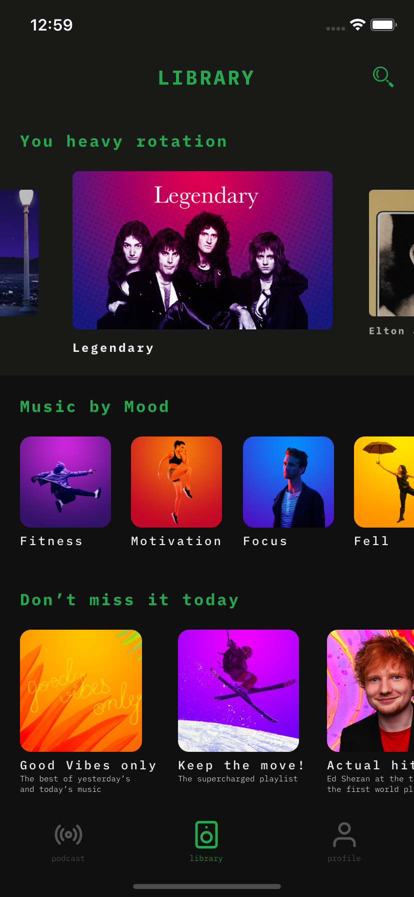
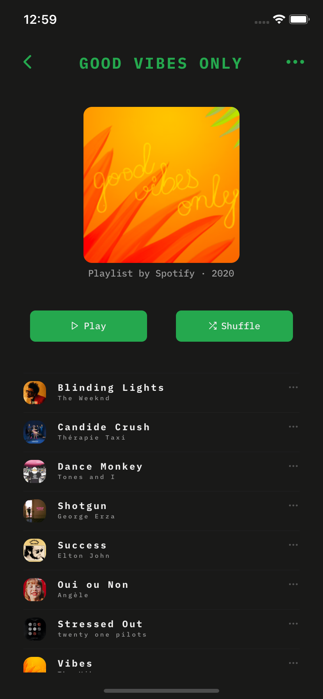
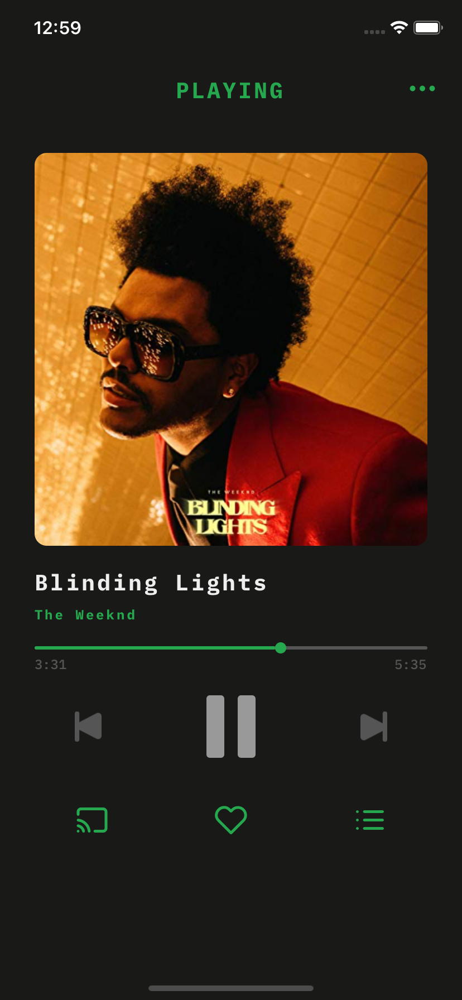

<h1 align="center">
  
 
 
Spotify Redesign
</h1>

Alternative design to Spotify for training

## Dependencies

- [Node.js](https://nodejs.org/en/) >= 8.0.0
- [Yarn](https://yarnpkg.com/pt-BR/docs/install)

## Getting started

1. Clone this repository;
2. `cd SpotifyRedesign`; 
3. Run `yarn` to install dependencies. 
4. Run `yarn ios` or `yarn android`.

## Screenshots

  
  
  

## License

This project is licensed under the MIT License - see the [LICENSE](LICENSE) file for details.
